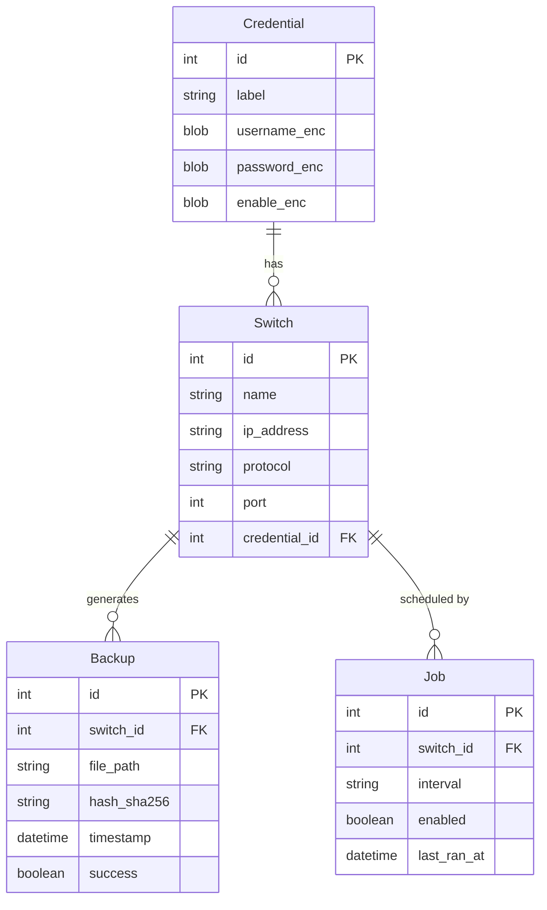

<p align="center">
  
</p>

<h1 align="center">🔧 NCM - Network Configuration Manager</h1>

<p align="center">
  <strong>Enterprise-Grade Switch Backup & Configuration Management for Allied Telesis</strong>
</p>

<p align="center">
  
  
  
  
  
</p>

<p align="center">
  <a href="#-features">Features</a> •
  <a href="#-quick-start">Quick Start</a> •
  <a href="#-architecture">Architecture</a> •
  <a href="#-security">Security</a> •
  <a href="#-documentation">Documentation</a>
</p>

---

## 🎯 Overview

**NCM (Network Configuration Manager)** is a production-ready Windows desktop application designed for IT infrastructure teams to efficiently backup, track, and manage configuration changes across Allied Telesis network switches. Built with enterprise security in mind, NCM provides automated backup scheduling, change detection with visual diff comparison, and encrypted credential storage.

## ✨ Features

<table>
<tr>
<td width="50%">

### 🌐 Multi-Protocol Support
- **SSH** - Secure encrypted connections
- **Telnet** - Legacy device compatibility  
- **WebSmart** - Allied Telesis web interface
- **WebSmart V2** - RSA-encrypted modern switches
- Custom port configuration per device

</td>
<td width="50%">

### 🔐 Enterprise Security
- **AES-128 Fernet Encryption** for credentials
- **PBKDF2-HMAC-SHA256** key derivation
- 100,000 iterations for maximum security
- Master passphrase never stored on disk
- Encrypted SQLite credential storage

</td>
</tr>
<tr>
<td>

### ⏰ Automated Scheduling
- Flexible intervals: 15m, 1h, 6h, 12h, 24h
- Background service mode support
- Windows Task Scheduler integration
- Automatic retry with exponential backoff

</td>
<td>

### 📊 Change Management
- **Visual Diff Viewer** with syntax highlighting
- Line-by-line comparison with line numbers
- Unified diff format
- Configuration change tracking over time

</td>
</tr>
<tr>
<td>

### 🗂️ Intelligent Retention
- Configurable 30-day default retention
- Automatic cleanup of old backups
- Minimum backup count guarantee
- Organized folder structure by device/date

</td>
<td>

### 🖥️ Modern UI/UX
- **ttkbootstrap** modern theme engine
- Non-blocking background operations
- Real-time backup status updates
- Comprehensive logging with 7-day rotation

</td>
</tr>
</table>

## 🚀 Quick Start

### Prerequisites

- **Python 3.11+** (required)
- **Windows 10/11**
- Network access to Allied Telesis switches

### Installation

```powershell
# 1️⃣ Clone the repository
git clone https://github.com/your-org/ncm-backup.git
cd ncm-backup

# 2️⃣ Create virtual environment (recommended)
python -m venv .venv
.\.venv\Scripts\Activate.ps1

# 3️⃣ Install dependencies
pip install -r requirements.txt

# 4️⃣ Launch the application
python -m app.main
```

### First Launch

1. 🔑 **Set Master Passphrase** - Create a secure passphrase (minimum 8 characters)
2. 📱 **Add Switches** - Go to Inventory tab and add your devices
3. 🔐 **Configure Credentials** - Add encrypted credentials in Credentials tab
4. ▶️ **Start Backing Up** - Manual backup or configure automated schedules

## 🏗️ Architecture

```
┌─────────────────────────────────────────────────────────────────┐
│                        NCM Application                          │
├─────────────────────────────────────────────────────────────────┤
│  ┌──────────────────────────────────────────────────────────┐   │
│  │                     UI Layer (tkinter)                   │   │
│  │  Dashboard │ Inventory │ Credentials │ History │ Diff   │   │
│  └──────────────────────────────────────────────────────────┘   │
│                              │                                   │
│  ┌──────────────────────────────────────────────────────────┐   │
│  │                    Service Layer                          │   │
│  │  BackupService │ CryptoService │ ScheduleService │ etc.  │   │
│  └──────────────────────────────────────────────────────────┘   │
│                              │                                   │
│  ┌─────────────────┐    ┌───────────────────┐                   │
│  │   Data Layer    │    │   Network Layer   │                   │
│  │ SQLite + ORM    │    │ SSH/Telnet/HTTP   │                   │
│  └─────────────────┘    └───────────────────┘                   │
└─────────────────────────────────────────────────────────────────┘
```

### Project Structure

```
📦 ncm-backup/
├── 📂 app/
│   ├── 📄 main.py              # Application entry point
│   ├── 📂 ui/                  # User interface modules
│   │   ├── app_window.py       # Main window container
│   │   ├── dashboard_view.py   # Overview dashboard
│   │   ├── inventory_view.py   # Switch management
│   │   ├── credentials_view.py # Credential vault
│   │   ├── history_view.py     # Backup history
│   │   ├── diff_view.py        # Configuration diff viewer
│   │   ├── schedules_view.py   # Scheduler management
│   │   └── settings_view.py    # Application settings
│   ├── 📂 services/            # Business logic layer
│   │   ├── backup_service.py   # Core backup execution
│   │   ├── crypto_service.py   # Encryption/decryption
│   │   ├── schedule_service.py # APScheduler integration
│   │   ├── retention_service.py# Cleanup automation
│   │   ├── diff_service.py     # Configuration comparison
│   │   └── export_service.py   # Data export utilities
│   ├── 📂 net/                 # Network communication
│   │   ├── runner.py           # Protocol abstraction
│   │   ├── ssh_client.py       # Paramiko SSH client
│   │   ├── telnet_client.py    # Telnet3 client
│   │   └── websmart_client.py  # WebSmart HTTP client
│   ├── 📂 data/                # Data persistence
│   │   ├── db.py               # SQLite connection
│   │   ├── models.py           # SQLAlchemy ORM models
│   │   └── repository.py       # Data access layer
│   └── 📂 config/              # Configuration
│       ├── appsettings.yaml    # App settings
│       └── logging_config.py   # Logging setup
├── 📂 backups/                 # Backup storage
├── 📂 logs/                    # Application logs
├── 📂 Dokumentasi/             # Documentation
├── 📄 requirements.txt         # Python dependencies
├── 📄 build.ps1                # Build script
└── 📄 README.md                # This file
```

## 🔒 Security

### Encryption Standards

| Component | Implementation |
|-----------|----------------|
| **Symmetric Encryption** | Fernet (AES-128-CBC) |
| **Key Derivation** | PBKDF2-HMAC-SHA256 |
| **Iterations** | 100,000 |
| **Salt** | 16-byte random per installation |
| **Credential Storage** | Encrypted JSON in SQLite |

### Security Best Practices

- ✅ Master passphrase required at every session start
- ✅ Credentials encrypted at rest
- ✅ No plaintext passwords in logs or files
- ✅ Session keys stored only in memory
- ✅ Secure connection protocols (SSH preferred)

> ⚠️ **Important**: If you lose your master passphrase, credential recovery is impossible. Store it securely!

## 📖 Usage Guide

### 📱 Managing Switches

1. Navigate to **Inventory** tab
2. Click **➕ Add Switch**
3. Fill in: Name, IP Address, Protocol (SSH/Telnet/WebSmart), Port
4. Assign credentials and save

### 🔐 Credential Management

1. Go to **Credentials** tab
2. Click **Add Credential**
3. Enter: Label, Username, Password, Enable Password (optional)
4. All data is encrypted automatically

### ⏱️ Scheduling Backups

1. Navigate to **Schedules** tab
2. Click **Add Schedule**
3. Select switch and interval (15m/1h/6h/12h/24h)
4. Enable and save

### 📊 Comparing Configurations

1. Go to **Backup History** tab
2. Select a switch from the dropdown
3. Choose two backup versions
4. Click **Show Diff** to view changes

## 🛠️ Building

### Development Build

```powershell
.\build.ps1
```

### Production Release

```powershell
.\build_production.ps1
```

Output: `dist\AlliedTelesisBackup.exe` (~38 MB standalone)

## 🧪 Testing

```powershell
# Run all tests with pytest
python -m pytest app/tests/ -v

# Run with unittest
python -m unittest discover app/tests/
```

## 📋 Database Schema



## 🔧 Troubleshooting

| Issue | Solution |
|-------|----------|
| **Connection timeout** | Verify IP, port, and firewall rules |
| **Authentication failed** | Check username/password in Credentials |
| **Prompt not detected** | Customize in Settings → Prompt Patterns |
| **WebSmart V2 fails** | Ensure RSA encryption support (pycryptodome) |
| **Passphrase lost** | Delete `data/master.key` + `data/app.db` (⚠️ loses all data) |

## 📦 Dependencies

| Package | Purpose |
|---------|---------|
| `ttkbootstrap` | Modern UI theming |
| `paramiko` | SSH connections |
| `telnetlib3` | Telnet support |
| `apscheduler` | Background scheduling |
| `sqlalchemy` | ORM database access |
| `cryptography` | Fernet encryption |
| `pycryptodome` | RSA for WebSmart V2 |
| `requests` | HTTP client |
| `beautifulsoup4` | HTML parsing |
| `pillow` | Image processing |
| `pywin32` | Windows service |

## 📚 Documentation

Detailed documentation available in the `Dokumentasi/` folder:

- 📘 [User Guide](Dokumentasi/user_guide.md)
- 📗 [WebSmart V2 Backup Flow](websmart_v2_backup_flow.md)
- 📙 [Application Overview](application_overview.md)

## 👥 Support

For internal support, contact the IT Infrastructure team.

---

<p align="center">
  <strong>NCM - Network Configuration Manager</strong><br>
  <em>Securing Your Network, One Backup at a Time</em>
</p>

<p align="center">
  Made with ❤️ by IT Infrastructure Team
</p>

<p align="center">
  <sub>© 2024-2025 | Proprietary - Internal Use Only</sub>
</p>
