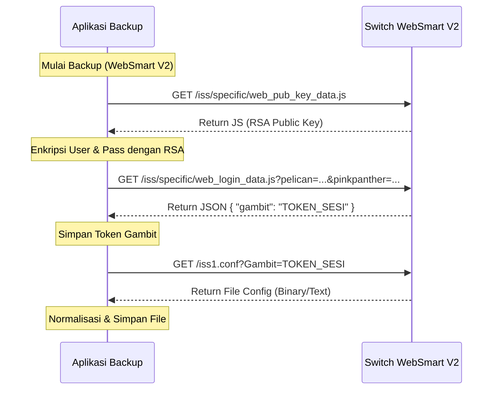
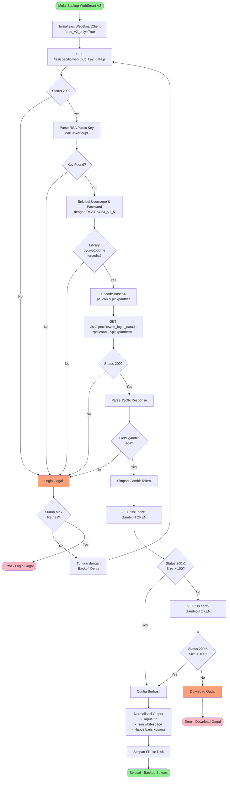

# Alur Backup WebSmart V2 (Allied Telesis)

Dokumen ini menjelaskan alur teknis proses backup untuk switch Allied Telesis WebSmart V2 (seperti GS950/52PS V2) yang menggunakan enkripsi RSA dan login berbasis API.

## Ringkasan Proses

Proses backup dilakukan oleh class `WebSmartClient` di `app/net/web_smart_client.py`. Berbeda dengan model lama yang menggunakan form POST sederhana, model V2 membutuhkan enkripsi RSA untuk kredensial dan menggunakan token sesi (Gambit) untuk otentikasi request selanjutnya.

## Detail Flow

### 1. Inisialisasi
- **Input**: Host (IP), Port (default 80), Username, Password.
- **Deteksi**: Jika protokol diset ke `websmart-v2` di `runner.py`, sistem akan memaksa penggunaan logika V2 (`force_v2_only=True`).

### 2. Otentikasi (Login)
Proses login V2 (`_try_v2_login`) terdiri dari beberapa langkah:

#### a. Pengambilan Public Key
- **Request**: GET ke `/iss/specific/web_pub_key_data.js`
- **Tujuan**: Mendapatkan RSA Public Key yang disediakan oleh switch.
- **Parsing**: Regex digunakan untuk mengekstrak blok kunci PEM dari respon JavaScript.

#### b. Enkripsi Kredensial
- Menggunakan library `Crypto.PublicKey.RSA` dan `Crypto.Cipher.PKCS1_v1_5`.
- **Username** dienkripsi dan di-encode base64 menjadi parameter `pelican`.
- **Password** dienkripsi dan di-encode base64 menjadi parameter `pinkpanther`.

#### c. Pengiriman Login Data
- **Request**: GET ke `/iss/specific/web_login_data.js`
- **Parameter**: 
  - `pelican`: Username terenkripsi
  - `pinkpanther`: Password terenkripsi
- **Headers**: Header `Accept` diubah sementara menjadi `application/json` untuk mengharapkan balasan JSON.

#### d. Validasi & Token
- **Respon**: JSON yang berisi token sesi.
- **Ekstraksi**: Token diambil dari field `gambit` dalam respon JSON.
- Token ini disimpan (`self.gambit_token`) untuk digunakan pada request download.

### 3. Pengambilan Konfigurasi (Backup)
Setelah login berhasil dan token didapatkan:

- **Target URL**: Sistem mencoba endpoint download berikut secara berurutan:
  1. `iss1.conf?Gambit={TOKEN}` (Standard V2)
  2. `iss.conf?Gambit={TOKEN}` (Fallback)
  
- **Proses Download**:
  - Melakukan GET request ke URL target.
  - Memeriksa `Content-Type` header.
  - Jika konten berupa text/binary (bukan HTML error page) dan ukurannya valid (>100 bytes), file dianggap berhasil didownload.

### 4. Normalisasi
- Output konfigurasi dibersihkan dari karakter `\r` (carriage return) untuk memastikan format line-ending Unix (`\n`) yang konsisten.
- Spasi berlebih di awal/akhir baris dan baris kosong di awal/akhir file dihapus.

### 5. Selesai
- Koneksi ditutup.
- File konfigurasi siap disimpan ke disk.

## Diagram Alur

### Sequence Diagram

### Flowchart Proses

